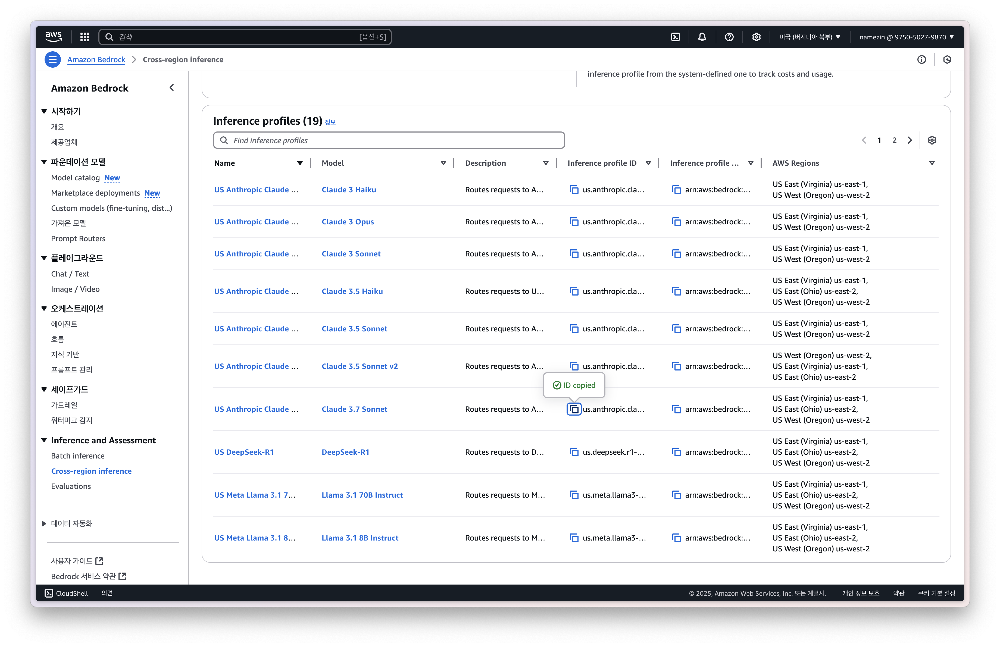
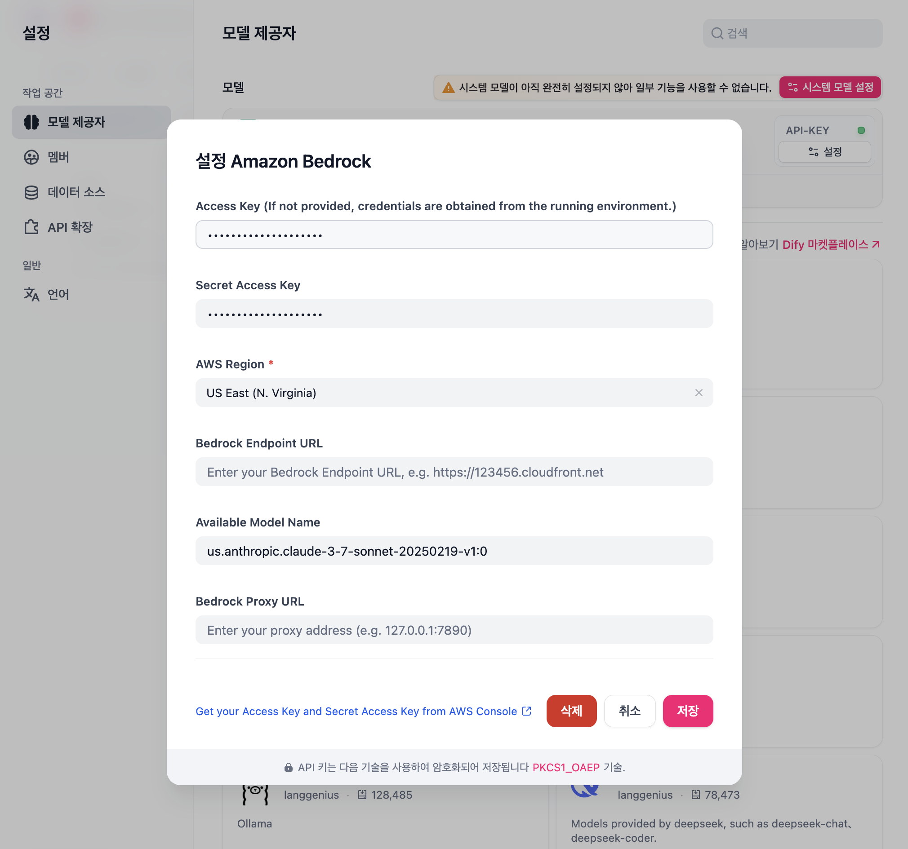

# AWS Bedrock Plugin

## 1. aws cli를 통해 credentials 생성

```bash
aws configure
```

## 2. access key, secret key, region 확인

```bash
cat ~/.aws/credentials
cat ~/.aws/config
```

## 3. bedrock inference 모델 확인



## 4. 플러그인 설정


